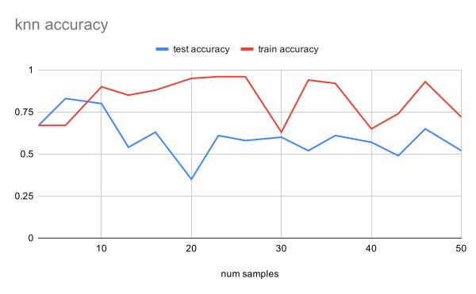
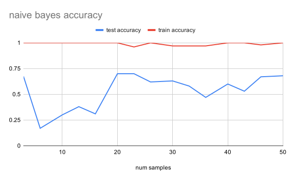

## Overview

I wanted to pursue a simple classification problem that would allow me to see
what the process of getting results on real data looked like.

For a dataset I chose to look at trip reports--long form posts people write
describing their experience in an outdoor adventure. I decided to try and
classify trip reports as being either single day or multi-day trips since it
seemed a simple enough problem that the probability of being able to get good
results was high.

Unfortunately I ran out of time to do more than a simple investigation of the
data--my ulterior motive was to gain experience writing and working with
Clojure.

## Method

To turn a trip report into a feature vector I created roughly the following
pipeline:

- parse trip report into words
- filter stopwords
- if configured, add bigrams and trigrams
- if configured, filter out terms that don't appear in at least a certain
  number of documents
- compute the term frequency-inverse document frequency for each term

To classify the trip reports I implemented the following algorithms:

- k-nearest neighbors
    - configurable k
    - configurable distance function (either cosine or euclidean distance)
- naive bayes

To evaluate classifiers I implemented k-fold cross validation and a
"progressive" validation which shows how results vary as the size of the test
and training sets are increased.


## Results

I labelled 100 trip reports as either being single-day or multi-day.

Running the validation routines yielded the following results:

```clojure
; feature configuration
{:term-types [:words]
 :df-threshold 0}

; model configuration
{:knn {:k 3, :distance-fn cosine-distance}
 :naive-bayes {}}
```

### Progressive validation





### K-fold Cross Validation

```
knn 10-fold cross-validation on ../data/datasets/summitpost-wa-first-100.dataset
Classes:
   multi-day: 62
   single-day: 38
Confusion matrix:
   multi-day: {multi-day 55, single-day 7}
   single-day: {multi-day 32, single-day 6}
Accuracy: 0.61
F1 Scores:
   multi-day: 0.74
   single-day: 0.24
```

```
naive-bayes 10-fold cross-validation on ../data/datasets/summitpost-wa-first-100.dataset
Classes:
   multi-day: 62
   single-day: 38
Confusion matrix:
   multi-day: {multi-day 62, single-day 0}
   single-day: {multi-day 35, single-day 3}
Accuracy: 0.65
F1 Scores:
   multi-day: 0.78
   single-day: 0.15
```

## Discussion

### KNN

When looking at the progressive validation graph the first thing that jumped
out at me is that the trend in training accuracy is flat and fluctuates around
80%. To me this suggests bias in the model because I would expect a properly
functioning model to overfit the data on small numbers of samples (i.e.
accuracy should start at 100%). Indeed, looking at the k-fold cross validation
results I see that very few trip reports were classified as `single-day`
overall, suggesting the model is biased towards the `multi-day` label.

One potential explanation is that the features I used don't create enough
"distance" between the two sets of samples. KNN works by a majority vote of
samples "nearest" to the one being labelled. Because there are nearly twice as
many `multi-day` samples as `single-day`, if their positions were highly
overlapped it would lead to `multi-day` labels being chosen more often simply
because there is a higher density of them.

A good way to test this theory would be to try adding more features to the data
(such as bigrams and trigrams) and see if the model starts overfitting the
training data.


### Naive Bayes

Looking at the progressive validation graph for naive bayes I see a case of
high variance. The model is clearly overfitting the data (nearly 100% training
accuracy) and as the number of samples used increases the accuracy on the test
data improves but is still well below 100%.

However when looking at the k-fold cross validation I see that the model
classified test samples as `multi-day` nearly every time. This looks very
similar to the k-fold cross validation for KNN. Does this mean the Naive Bayes
model is also biased? I don't think so. If the model were biased towards
`multi-day` it would not be able to overfit the data so well, which I clearly
see when testing against training data. Instead, I think this indicates that
the model is failing to generalize well. 

One explanation for why the model favors the `multi-day` even though it
overfits training data is based in how the model works. Naive Bayes is based on
a probability calculation. Since there are many more `multi-day` samples, the
posterior probability that a given sample is `multi-day` will be fairly high,
weighting the model in that direction when it can't otherwise distinguish
between the labels.

A good way to test this theory would be to reduce the variance by reducing the
number of features (for example by filtering out words that don't appear in
more than 5 documents) and seeing how this affects the overfitting issue and
the favoring of the `multi-day` label. 
