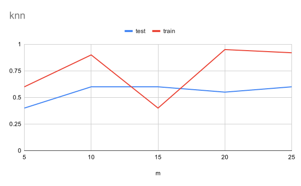

## Overview

I wanted to pursue a simple classification problem that would allow me to see
what the process of getting results on real data looked like.

For a dataset I chose to look at trip reports which are long form posts people
write describing their experience in an outdoor adventure. I decided to try and
classify trip reports as being either single day or multi-day trips since it
seemed a simple enough problem that the probability of being able to get good
results was high.

## Method

To turn a trip report into a feature vector I created roughly the following
pipeline:

- parse trip report into words
- filter stopwords
- if configured, add bigrams and trigrams
- compute the term frequency-inverse document frequency for each term

To classify the trip reports I implemented the following algorithms:

- k-nearest neighbors
    - configurable k
    - configurable distance function (either cosine or euclidean distance)
- naive bayes

To evaluate classifiers I implemented k-fold cross validation and a
"progressive" validation which shows how results vary as the size of the test
and training sets are increased.

## First Pass

I labelled 50 trip reports as either being single-day or multi-day.

Running the progressive validation scheme yielded the following results:

### KNN

| m  | test  | train |
|----|-------|-------|
| 5  | 0.4   | 0.6   |
| 10 | 0.6   | 0.9   |
| 15 | 0.6   | 0.4   |
| 20 | 0.55  | 0.95  |
| 25 | 0.6   | 0.92  |

### Naive Bayes

| m  | test | train |
|----|------|-------|
| 5  | 0.6  | 1     |
| 10 | 0.5  | 1     |
| 15 | 0.33 | 1     |
| 20 | 0.5  | 1     |
| 25 | 0.56 | 1     |
